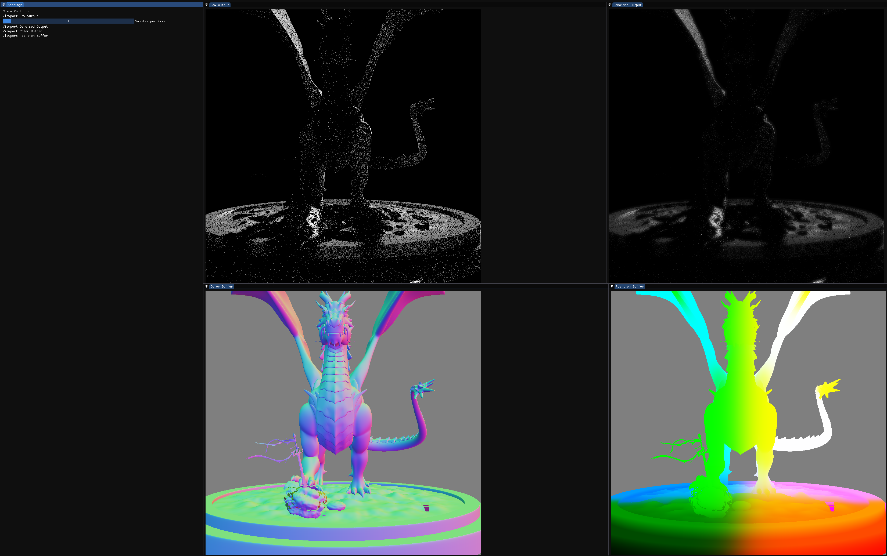

# Sakura

A GPU renderer written with CUDA, initially for the Computer Graphics lecture at ETH Zurich.

## Usage

First clone the repository and initialize the submodules using `git submodule update --init --recursive`.

If all the prerequisites are installed, the executable can be generated using the following commands:

```
mkdir build
cd build
cmake ..
make 
```

or `make -j N` to make use of N threads

The renderer launches a graphical interface that displays various elements of the scene.



## Examples

In order to create a 3D effect without use of glasses, the renderer can be used to create stereoscopic content by
rendering the scene from two slightly different perspectives. The following example shows a dragon model rendered in
stereoscopic mode with moving cameras.


In order to see the video in 3D, cross your eyes to overlap the images.


[//]: # (## Example Images)

[//]: # (![CornellBox]&#40;renders/CBOX4K512spp.png "Cornell Box render"&#41;)


[//]: # (## Special Features)

[//]: # ()

[//]: # (#### Adaptive Sampling)

[//]: # (|                Test Scene                |               Sample Distribution               |)

[//]: # (|:----------------------------------------:|:-----------------------------------------------:|)

[//]: # (| ![]&#40;renders/images/adaptiveSampling.png&#41; | ![]&#40;renders/images/adaptiveSamplingSamples.png&#41; |)
